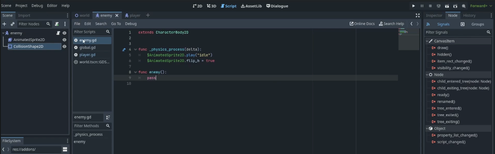

Download AssetLib Dialogue Manager 2 or 3. After downloading, you will receive the addon folder. 

Go to Project -> Project Setting -> Plugins -> Enable Dialogue Manager

To work in Dialogue Manager:

- Click on Dialogue on the bar

- Click on this to add a new Dialogue

- Create and save a dialogue

- Base code. U can delete it 

Example:

The – works as same as if statement.

- U can press on this icon to test dialogue

- Next we need a global script so we can we can access variables for dialogue from the global script

- Next go to Project -> Project Setting -> Autoload to autoload global.gd. Press add to add

- Inside global. U can define global variables. For example:

- After defining, you can use these variables in your dialogue file

- To make the dialogue run in the game. First: Go to character node add Area 2D as child of the character node, next add a CollisionShape2D as a child of Area 2D node

  

- Next, press on Node next to the inspector to add signals. Add the body_entered and body_exited of Area2D, signal it to character

- After that, you will have 2 new function inside character.gd

  

- Declare a variable to check if the thing you want to talk with inside the range:

- Change the body_entered and body_exited function of character.gd with that variable to check in/out range

- Next for the thing you want to talk with(NPC/object), it should also have Area2D and collisionshape2D

- Inside their script, add the function. The function’s name should be the same as the one you called in body.has_method(…). For example: I called body.has_method(enemy) so I need a func enemy()

- Next, inside the func _physics_process(delta: float) -> void, we will add some lines of code to check if the thing to want to talk with in range to start the dialogue. The code should have the prototype as this: 

The circled part is the variable you declared the step before. Input.is_action_.... ( you choose), DialogueManager.show_example_dialogue_balloon(load(“…(the place you save your dialogue), “…”) (the first line inside the dialogue file. For example: ~main, so you fill the blank with main).

- So now you dialogue can work!

- However, in my example dialogue , I have the global variable so to make it work I need to do few more step.

- Inside the map, I add the item, then add the Area2D and collision_shape2D for it too. For example: I add leaf

- Next, declare the variable to check if the item you want to interact with in range. For example : var in_leaf_dec = false inside character.gd.

- Next, add body_exited and body_entered of that item into character.gd. Also declare the func character() (or sth else, u can choose the name)

  

 

- Next you can add some code. In my example, I want to take the leaf then give it to the tree.So inside the func _physics_process(delta: float) -> void: , I add some line of code to check if the leaf is in range to take it, then I set my global variable ( found_tree_item to true)

  

- Also the leaf should be invisible after pick up, so inside world.gd, I add a function to set it to invisible: 

That’s all.

